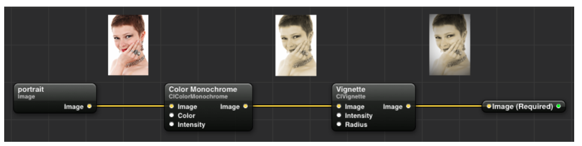

# CoreImageSwift

`CoreImage` được sử dụng cho một mục đích duy nhất, đó là apply `filers`, `resize   ` cho các `images` theo nhiều cách khác nhau.


# I. Overview and Example

`CoreImage` là một framework super-fast, super-powerful mà được cung cấp bởi apple. Để hiểu về `CoreImage`, ta cần hiểu về 2 concepts cơ bản sau đây:

- `filter`: Là một đối tượng nhận các images làm đối tượng đầu vào, sau đó filter để ra được các images output.
- `filter graph`: là một chuỗi các `filter` được liên kết với nhau với mục địch apply nhiều `filter` cho các input nhất có thể.

```swift
import CoreImage
import CoreImage.CIFilterBuiltins
```


Có 2 cách để khởi tạo một `CIFilter` như ở dưới đây:

```swift
let filter1 = CIFilter.colorMonochrome()  //Cách này chỉ áp dụng được khi import CoreImage.CIFilterBuiltins
let filter2 = CIFilter(name: "CIColorMonochrome")  
```


Ta hãy vào [here](https://developer.apple.com/library/archive/documentation/GraphicsImaging/Reference/CoreImageFilterReference/), để tìm hiểu rõ có những loại filter nào, và áp dụng chúng như nào.


- `Example 1 Graph Filter`: Ta có một ảnh input, và ta muốn filter được kết quả cuối như dưới đây:




```swift
let inputImage = CIImage(image: uiImage)

let sepiaColor = CIColor(red: 0.76, green: 0.65, blue: 0.54)
let monochromeFilter = CIFilter(name: "CIColorMonochrome", withInputParameters: ["inputColor" : sepiaColor, "inputIntensity" : 1.0])
monochromeFilter.setValue(inputImage, forKey: "inputImage")

let vignetteFilter = CIFilter(name: "CIVignette", withInputParameters: ["inputRadius" : 1.75, "inputIntensity" : 1.0])
vignetteFilter.setValue(monochromeFilter.outputImage, forKey: "inputImage")

let outputImage = vignetteFilter.outputImage
```


- `Example 2 Filter and Resize Image`:
  
```swift
guard let image = image.cgImage else { return }
let currentCIImage = CIImage(cgImage: image)
let filter = CIFilter(name: "CIColorMonochrome")
filter?.setValue(currentCIImage, forKey: "inputImage")
filter?.setValue(CIColor(red: 0.7, green: 0.7, blue: 0.7), forKey: "inputColor")
filter?.setValue(1.0, forKey: "inputIntensity")
guard let outputImage = filter?.outputImage else { return }

// Apply the resize filter
let scale = size / min(outputImage.extent.width, outputImage.extent.height)
let resizeFilter = CIFilter(name: "CILanczosScaleTransform")
resizeFilter?.setValue(outputImage, forKey: kCIInputImageKey)
resizeFilter?.setValue(scale, forKey: kCIInputScaleKey)
resizeFilter?.setValue(1.0, forKey: kCIInputAspectRatioKey)

// Get the output of the resize filter
guard let outputResizedImage = resizeFilter?.outputImage else { return }
```


# II. Fetching a Filtered Image 

Như đã thấy `Filters` có một thuộc tính là `outputImage`, và nó thuộc kiểu `CIImage`. Vậy làm thế nào ta lấy được `UIImage` từ `CGImage` ? 
- Đầu tiên để tạo một `UIImage` từ `CIImage` là rất dễ dáng, thông qua đoạn code: `UIImage(ciImage: )`. Tuy nhiên ở đây ta sẽ không dùng cách đó, bởi vấn đề hiệu năng. Như trong trường hợp ta cần convert một số lương lớn, ví dụ là ta apply filter color khi kéo `slider` màu sắc, lúc đấy hệ thống sẽ cần convert liên tục, dẫn đến giật lag. Để giải quyết vấn đề này, ta sẽ sử dụng `CIContext` để có thể reuse, nhằm mục đích tăng performance.

```swift
// Tạo CIContext
let ciContext = CIContext(options: nil)
let cgImage = ciContext.createCGImage(filter.outputImage, fromRect: inputImage.extent())
```


Lý do tại sao ta lại sử dụng `inputImage.extent()` bởi vì `outputImage` thường có `dimension` khác `inputImage`. Cho ví dụ như một `a blurred image` thường có nhiều `pixel hơn ở phần border`.


# III. Improving Performance with OpenGL - Ghi để biết thôi chứ cái này deprate rồi và cũng đang ko dùng được.

Ta phải biết rằng việc sử dụng `CPU` để draw `CGImage` sẽ tốn hiệu năng, nếu việc draw càng nhiều việc tốn hiệu năng và thời gian càng lớn. Vì vậy đôi khi ta muốn có thể vẽ `image đã lọc lên screen` mà không cần thông qua `Core Graphics`. May mắn thay, nhờ khả năng tương tác của `OpenGL` và `Core Image`, ta có thể thực hiện chính xác điều đó:

- Để có thể chia sẻ tài nguyên(`resource`) giữa `OpenGL context and a Core Image context`, ta cần khởi tạo `CIContext` theo một cách khác như sau:

```swift
let eaglContext = EAGLContext(API: .OpenGLES2)
let ciContext = CIContext(EAGLContext: context)
```

- Here, we create an `EAGLContext` with the OpenGL ES 2.0 feature set. `This GL context can be used as the backing context for a GLKView or for drawing into a CAEAGLLayer. The sample code uses this technique to draw images efficiently.` Khi một `CIContext` được liên kết với một `GL context`, `filterd image` có thể được draw với `OpenGL` thông qua đoạn code sau:


```swift
ciContext.drawImage(filter.outputImage, inRect: outputBounds, fromRect: inputBounds)
```


# IV. Reference

1. [Core Image Filter Reference](https://developer.apple.com/library/archive/documentation/GraphicsImaging/Reference/CoreImageFilterReference/)
2. [An Introduction to Core Image](https://www.objc.io/issues/21-camera-and-photos/core-image-intro/)
3. [Apple Core Image](https://developer.apple.com/documentation/coreimage/cifilter)